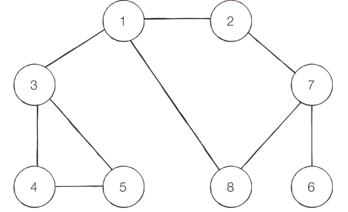

# DFS(Depth-First Search)
* 깊이 우선 탐색
* 그래프에서 깊은 부분을 우선적으로 탐색
* **스택 자료구조** 또는 **재귀함수** 이용

> 동작과정
> 1. 탐색 시작 노드를 스택에 삽입하고 방문 처리
> 2. 스택의 최상단 노드에 방문하지 않은 인접한 노드가 하나라도 있으면 그 노드를 스택에 넣고 방문처리. 방문하지 않은 인접 노드가 없으면 스택에서 최상단 노드 꺼냄
> 3. 더 이상의 2번의 과정을 수행할 수 없을 때까지 반복   

</br>
</br>

   
방문 기준 : 번호가 낮은 인접 노드부터   
탐색 순서 : 1->2->7->6->8->3->4->5   
(가장 깊게 들어가면 stack pop)
최대한 깊게 들어가려 동작   

```ruby
def dfs(graph,v,visited):
    #현재 노드 방문 처리
    visited[v]=True
    print(v,end=' ')
    #현재 노드와 연결된 다른 노드 재귀적으로 방문
    for i in graph[v]:
        if not visited[i]:
            dfs(graph,i,visited)

# 각 노드가 연결된 정보를 표현(2차원 리스트)
graph = [
    [],
    [2,3,8],
    [1,7],
    [1,4,5],
    [3,5],
    [3,4],
    [7],
    [2,6,8],
    [1,7]
]

# 각 노드가 방문된 정보 표현(1차원 리스트)
visited = [False]*9

#정의된 dfs함수 호출
dfs(graph,1,visited) # 1 2 7 6 8 3 4 5
```
</br>
</br>

# BFS (Breadth-First Search)
* 너비우선 탐색
* 그래프에서 가까운 노드부터 우선적으로 탐색 
* **큐 자료구조** 사용
* 특정 조건에서 최단거리 계산하는 데 사용

> 동작 과정
> 1. 탐색 시작 노드를 큐에 삽입하고 방문 처리
> 2. 큐에서 노드를 꺼낸 뒤에 해당 노드의 인접 노드 중에서 방문하지 않은 노드를 모두 큐에 삽입하고 방문 처리
> 3. 더이상 2번의 과정을 수행할 수 없을 때 까지 반복

</br>

   
방문 기준 : 번호가 낮은 인접 노드부터   
탐색 순서 : 1->2->3->8->7->4->5->6   
(탐색할 인접 노드가 없다면 queue pop)   
거리가 같은 길이 순서대로 탐색   
**간선의 비용이 동일한 상태에서 최단거리 탐색에 사용**

```ruby
from collections import deque

def bfs(graph,start,visited):
    # 큐 구현을 위해 deque라이브러리 사용
    queue = deque([start])
    # 현재 노드 방문처리
    visted[start] = True

    #큐가 빌 때까지 반복
    while queue:
        # 큐에서 하나의 원소 뽑아 출력
        v = queue.popleft()
        print(v,end=' ')
        #아직 방문하지 않은 인접 원수 큐에 삽입
        for i in graph[v]:
            if not visted[i]:
                queue.append(i)
                visited[i]=True


# 각 노드가 연결된 정보를 표현(2차원 리스트)
graph = [
    [],
    [2,3,8],
    [1,7],
    [1,4,5],
    [3,5],
    [3,4],
    [7],
    [2,6,8],
    [1,7]
]

# 각 노드가 방문된 정보 표현(1차원 리스트)
visited = [False]*9

#정의된 dfs함수 호출
dfs(graph,1,visited) # 1 2 3 8 7 4 5 6 
```